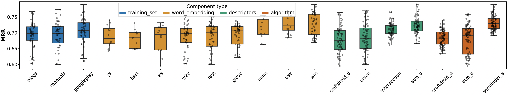
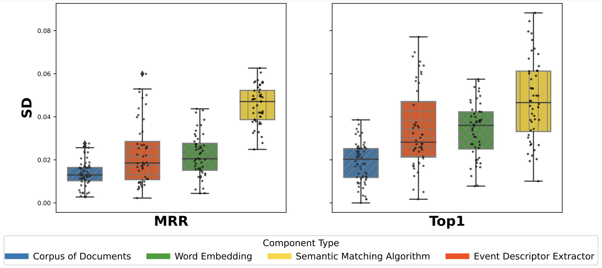

# Semantic Matching Evaluator
This repository provides the replication package of our paper "Semantic Matching of GUI Events for Test Reuse: Are We There Yet?" presented at the 30th ACM/SIGSOFT International Symposium on Software Testing and Analysis (ISSTA) 2021.
Execute experimental procedures for evaluating different semantic matching configurations of semantic matching in isolation.
Configurations include those that are used by the three stat-of-art test reuse approaches (ATM, Craftdroid, Adapatdroid) as well as new configurations introduced in this study.
In total there are 337 configurations.
Each configuration is evaluated by two metrics: MRR and Top1.

**Input:**
- Descriptors of source events: `events/src_events`
- Descriptors of target events: `events/target_events`
- Mapping of correct matches between source to target events: `events/index_map.csv`

**Output:**
- Result of semantic matching in isolation `results.csv`
- Similarity score of each candidate grouped by semantic matching configurations: `sim_scores`


> Note: FAST embedding approach requires 20 GB RAM in case of the standard train set
 

## Screenshots

*Effectiveness of different semantic matching instances*


*Effectiveness of semantic matching components*


## Setup


- virtualenv
- python3.7
- python3.7-dev
- g++
- build-essential
- libssl-dev
- 32 GB RAM 

> **Note:** The 32GB RAM requirement is needed for the fast text word embedding models to be used. The rest of the models can be used with 16GB.

The requirements can be installed with the following command.

```sh
sudo apt install virtualenv  python3.7 python3.7-dev build-essential libssl-dev
```

1. Create a virtual environment:
```sh
virtualenv -p /usr/bin/python3.7 venv
```

2. Activate the environment:
```sh
source venv/bin/activate
```

3. Install required packages

```shell
pip install -r requirements.txt
```

## Run

1. Modify `config.yml` following entry:
 - `model_dir` : path to the word embedding models with respect to `model_path` entry

2. Run semantic matching

```shell
python run_all_combinations.py
```
3. check the results
    - MRR and top1 values in available the `final.csv`.
    - Results of the table in the paper are available in `table_mrr.csv` and `tabel_top1.csv`
4. Results are saved in the `results.csv` file.
 
> Note: if you stop the framework while it is evaluating configurations, in the next run it will resume from the last evaluated configuration.
 
> Note:  The amount of time required for evaluating a configuration depends on the embedding approach and. It may vary from 5 min (w2v) to 1 hours (USE).
 
 
 
When evaluation of configurations are successful you should see following output
 
```
atm_0-union-android-wm Top1: 147 MRR: 0.6758521597097267
atm_0-intersection-android-wm Top1: 179 MRR: 0.7267089012475919
craftdroid-union-blogs-wm Top1: 168 MRR: 0.6797442714574846
```
 
For configurations that already have been evaluated and results have been saved you should see following output:
 
```
craftdroid-union-android-wm already exist
craftdroid-intersection-android-wm already exist
custom-union-android-wm already exist
custom-intersection-android-wm already exist
```
